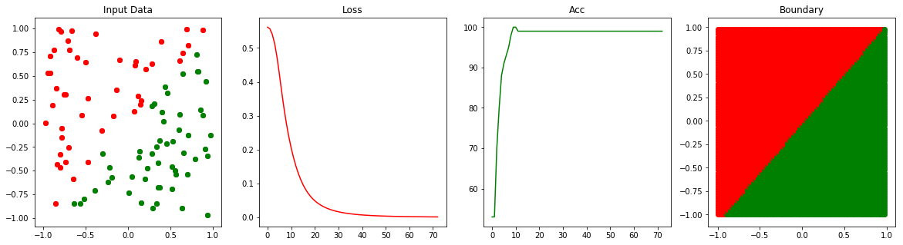

Backpropagation for Neural Network.  
Reference: Martin T. Hagan, et al., Neural Networks Design, Chapter 11.  
I present a two categories classification for a 2-4-2 neural network with backpropagation algorithm, the details of backpropagation algorithm can refer to Martin T. Hagan, et al., Neural Networks Design, Chapter 11.  
Specifically, in the neural netwok, a sigmoid function is choiced as an activation function, and MSE is choiced as the loss function.  
The results can be seen as follows:    
